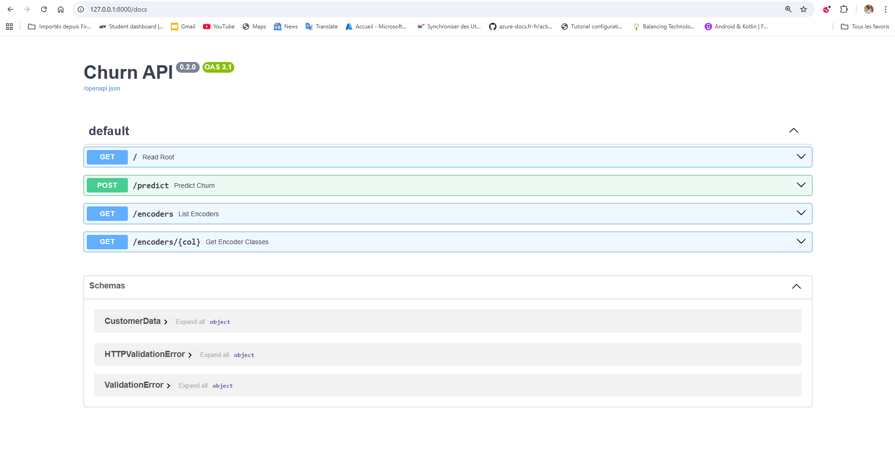
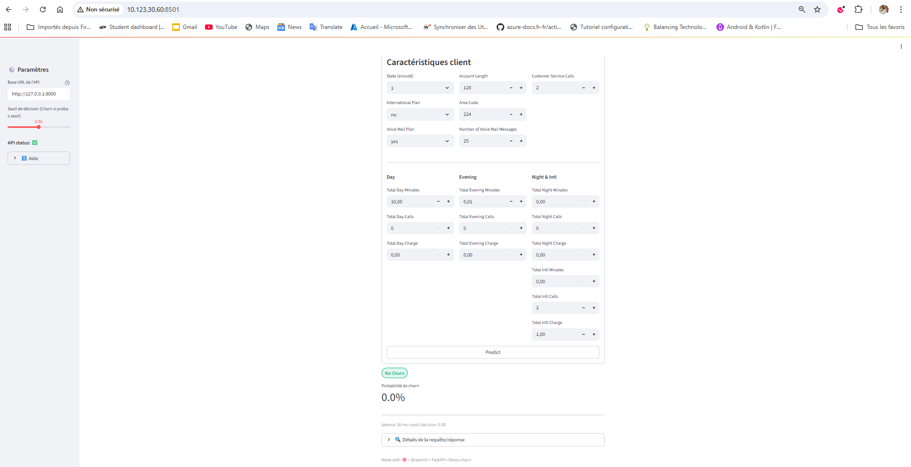

# 🚀 Churn Deployment

[](https://www.python.org/)
[](https://fastapi.tiangolo.com/)
[](https://streamlit.io/)
[](https://www.terraform.io/)
[](./LICENSE)

## 📖 Description

Ce projet met en place une **API FastAPI** et une **application Streamlit** pour l’analyse et la prédiction du **churn (attrition client)**.  
L’infrastructure est automatisée via **Terraform** et déployée sur **AWS EC2**.  

### Objectifs :
- Fournir une API backend performante pour exposer un modèle de prédiction.  
- Offrir une interface utilisateur simple via Streamlit pour tester et visualiser les résultats.  
- Gérer l’infrastructure **as code (IaC)** avec Terraform pour fiabilité et traçabilité.  

---

## 📂 Structure du projet

```bash
.
├── churn/
│   ├── api/            # API FastAPI
│   │   ├── api_churn.py
│   │   └── requirements.txt
│   └── streamlit/      # App Streamlit
│       ├── app_streamlit.py
│       └── requirements.txt
├── infra/              # Infrastructure (Terraform)
│   ├── main.tf
│   ├── variables.tf
│   ├── outputs.tf
│   ├── provider.tf
│   └── user_data.sh
├── docs/               # Documentation & images
│   └── images/
├── README.md
└── .gitignore
````

---

## 🖼️ Aperçu

### FastAPI Docs



### Streamlit Dashboard



---

## ⚙️ Installation locale

### Backend : API FastAPI

```bash
cd churn/api
python3 -m venv .venv
source .venv/bin/activate   # sous Windows: .venv\Scripts\activate
pip install -r requirements.txt

uvicorn api_churn:app --reload --host 0.0.0.0 --port 8000
```

* API : [http://localhost:8000](http://localhost:8000)
* Docs Swagger : [http://localhost:8000/docs](http://localhost:8000/docs)

---

### Frontend : Streamlit

```bash
cd churn/streamlit
python3 -m venv .venv
source .venv/bin/activate   # sous Windows: .venv\Scripts\activate
pip install -r requirements.txt

streamlit run app_streamlit.py --server.port 8501
```

* UI : [http://localhost:8501](http://localhost:8501)

---

## ☁️ Déploiement sur AWS avec Terraform

### Prérequis

* [Terraform](https://developer.hashicorp.com/terraform/downloads) (`terraform -v`)
* [AWS CLI](https://docs.aws.amazon.com/cli/) configuré (`aws configure`)

### Étapes de déploiement

```bash
cd infra
terraform init
terraform validate
terraform plan
terraform apply -auto-approve
```

👉 Une fois déployé :

* API : `http://<EC2-PUBLIC-IP>:8000`
* Streamlit : `http://<EC2-PUBLIC-IP>:8501`

---

## 🔒 Sécurité & Bonnes pratiques

* **Ne jamais exposer directement l’instance EC2** → utiliser un **Application Load Balancer (ALB)**.
* Stocker les **secrets** (API keys, credentials DB) dans **AWS Systems Manager Parameter Store** ou **AWS Secrets Manager**.
* Prévoir des **groupes de sécurité restrictifs** (ouvrir uniquement les ports 80/443 et ceux nécessaires).

---

## 🚀 Améliorations possibles

* [ ] Ajouter un pipeline CI/CD (GitHub Actions) :

  * Lint (Flake8 / Black)
  * Tests unitaires
  * `terraform validate` + `terraform fmt`
* [ ] Déploiement Dockerisé pour API + Streamlit
* [ ] Monitoring via CloudWatch

---

## 📜 Licence

Ce projet est distribué sous licence [MIT](./LICENSE).

---

## ✨ Auteur

👤 **Youssouf Vessou TRAORÉ**
Chef de Département Technique & Opérations @ DBA
Passionné par le **Cloud**, l’**IA** et l’**EdTech** 🚀

```